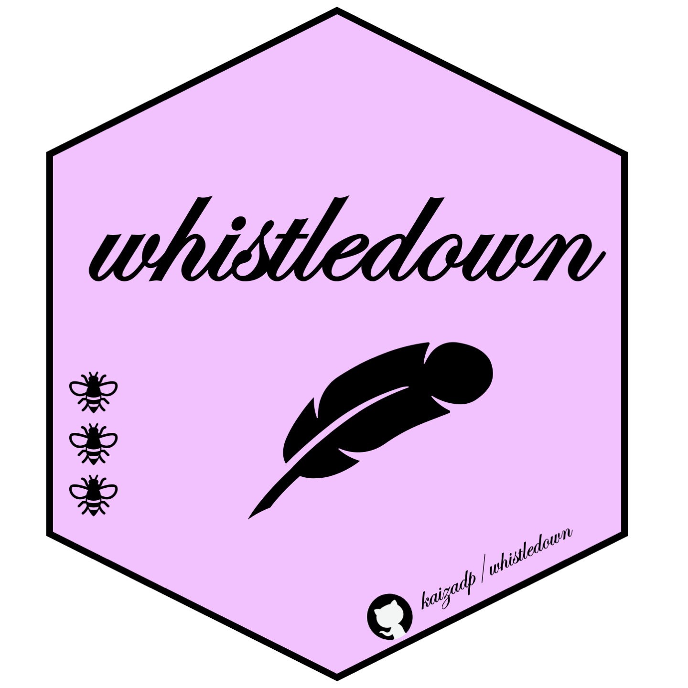
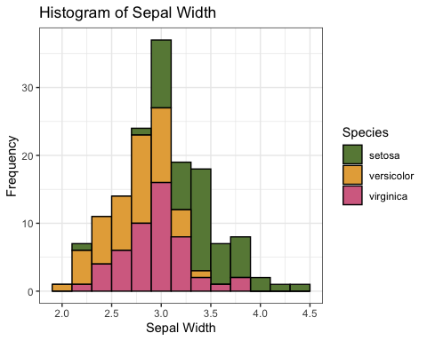
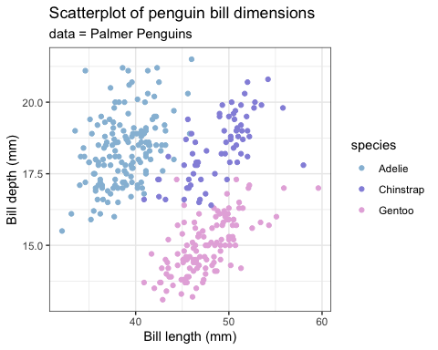
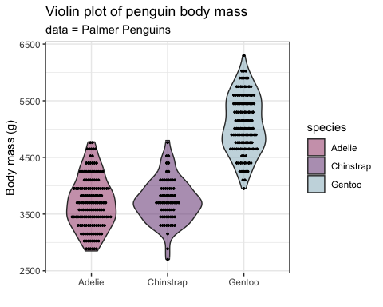
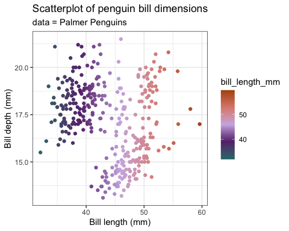

# whistledown

This package contains color palettes for RStudio, inspired by the show
Bridgerton. Palettes are colorblind-friendly and were created using
[Coolors](https://coolors.co).

Source images and color hex values can be found in the
[`images.md`](https://github.com/kaizadp/whistledown/blob/master/images.md)
file in the root directory.

------------------------------------------------------------------------

### install package

``` r
# install.packages("devtools") 
devtools::install_github("kaizadp/whistledown")
```

------------------------------------------------------------------------

<details>
<summary>
Palettes
</summary>

#### soil orders, suborders, and great groups

<!-- --><!-- --><!-- --><!-- -->

------------------------------------------------------------------------

</details>
<details>
<summary>
Examples
</summary>

``` r
library(ggplot2)

ggplot(data=iris, aes(x=Sepal.Width, fill = Species))+
  geom_histogram(binwidth=0.2, color="black") + 
  xlab("Sepal Width") +  ylab("Frequency") + 
  ggtitle("Histogram of Sepal Width") + theme_bw()+
  
  scale_fill_manual(values = whistledown_palette("featherington",3))
```

<!-- -->

``` r
ggplot(data=iris, aes(x=Sepal.Width, fill=Species)) + 
  geom_density(stat="density", alpha=(0.6)) +
  xlab("Sepal Width") +  ylab("Density") + 
  ggtitle("Histogram & Density Curve of Sepal Width") + theme_bw()+
  
  scale_fill_manual(values = whistledown_palette("red",3))
```

<!-- -->

``` r
library(palmerpenguins)

ggplot(penguins, aes(x = bill_length_mm, y = bill_depth_mm, color = species))+
  geom_point()+ 
  labs(x = "Bill length (mm)", y = "Bill depth (mm)",
       title = "Scatterplot of penguin bill dimensions",
       subtitle = "data = Palmer Penguins")+
  theme_bw()+
  
  scale_color_manual(values = whistledown_palette("danbury", 3)) 
```

<!-- -->

``` r
ggplot(penguins, aes(y = body_mass_g, x = species, fill = species))+
  geom_violin(alpha = 0.5)+ 
  geom_dotplot(binaxis = "y", color = "black", fill="black", dotsize=0.3, stackdir = "center", binpositions="all")+
  labs(y = "Body mass (g)", x = "",
       title = "Violin plot of penguin body mass",
       subtitle = "data = Palmer Penguins")+
  theme_bw()+
  
  scale_fill_manual(values = whistledown_palette("sharmaji", 3)) 
```

<!-- -->

``` r
ggplot(penguins, aes(x = bill_length_mm, y = bill_depth_mm, color = bill_length_mm))+
  geom_point()+ 
  labs(x = "Bill length (mm)", y = "Bill depth (mm)",
       title = "Scatterplot of penguin bill dimensions",
       subtitle = "data = Palmer Penguins")+
  theme_bw()+
  
  scale_color_gradientn(colors = rev(whistledown_palette("featherington",5))) 
```

<!-- -->
</details>
<details>
<summary>
Acknowledgments and Contributions
</summary>

Code structure was modelled after the
[`PNWColors`](https://github.com/jakelawlor/PNWColors) and
[`wesanderson`](https://github.com/karthik/wesanderson) packages.  
Contribute soil palettes in the
[issues](https://github.com/kaizadp/soilpalettes/issues/6).

</summary>
