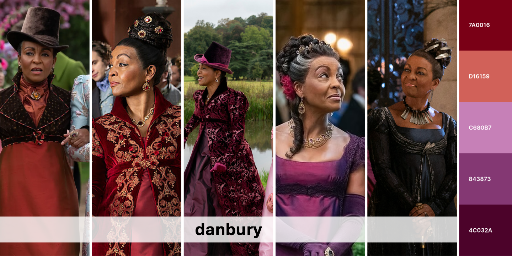
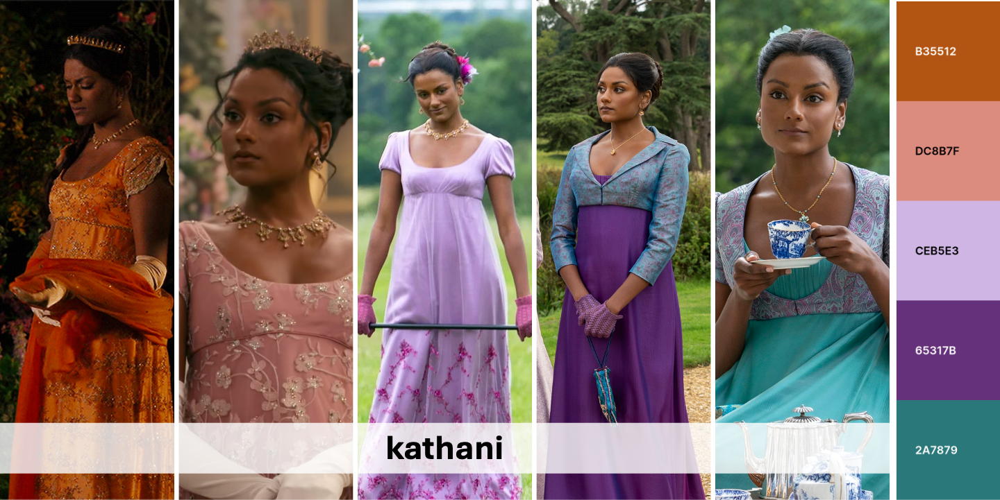
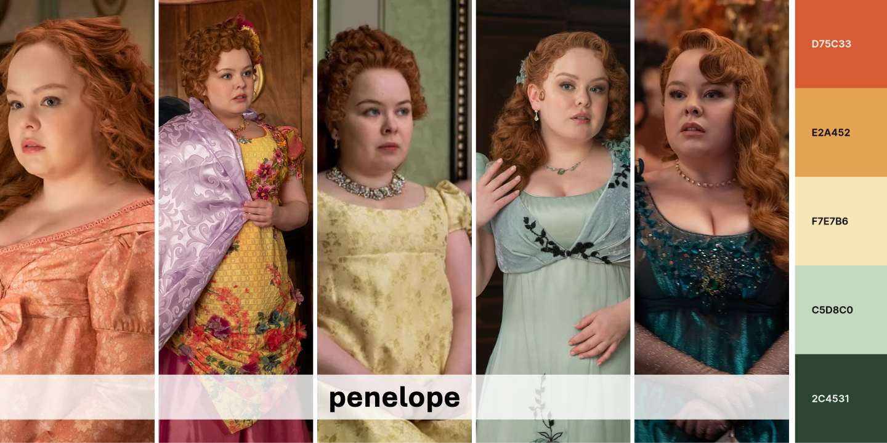
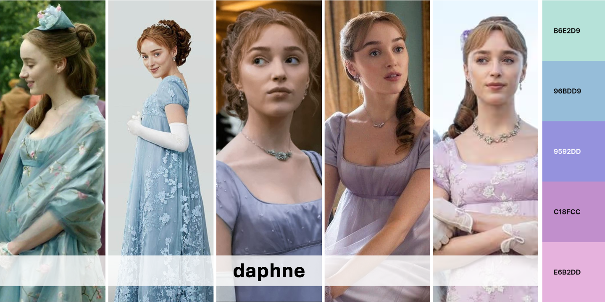
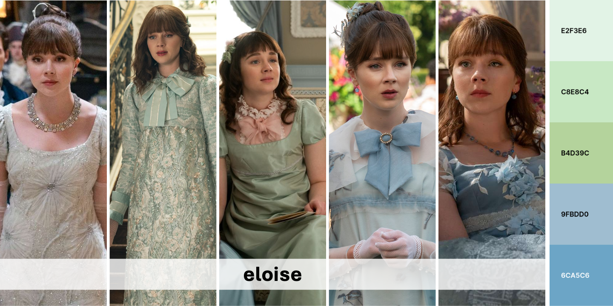
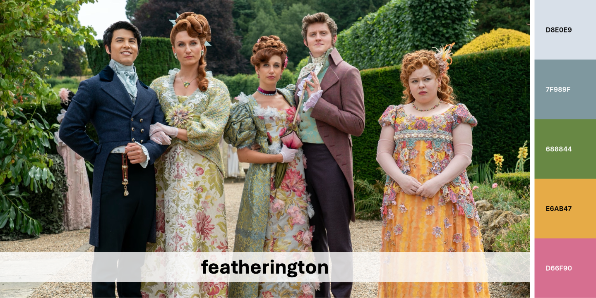
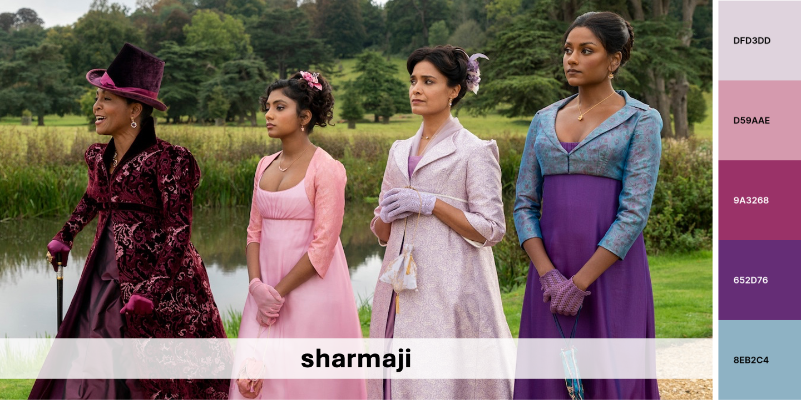
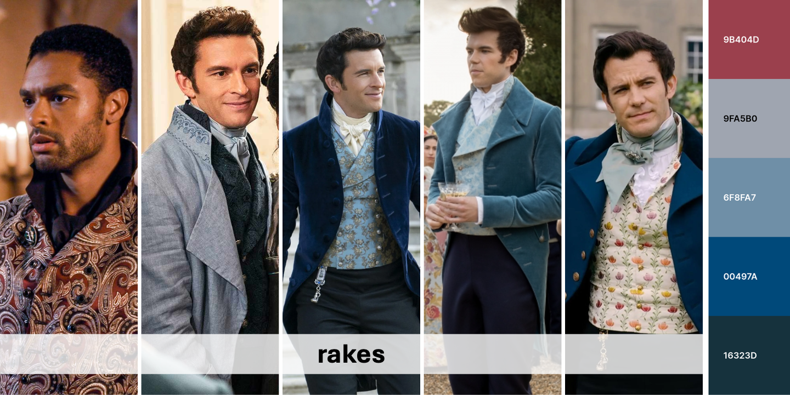

<br>

# whistledown 

Dearest Reader,

A most exquisite collection has entered society: an R package devoted
entirely to the sumptious hues of our beloved Bridgerton world. Within
it, one shall find palettes fit for the grandest ballroom plots and the
most scandalous of statistical revelations.

Pray, wield these colors boldly – for what is data visualization, if not
another stage upon which brilliance must be displayed?

<br>

------------------------------------------------------------------------

## install package

``` r
# install.packages("devtools") 
devtools::install_github("kaizadp/whistledown")
```

------------------------------------------------------------------------

## Palettes



------------------------------------------------------------------------


------------------------------------------------------------------------



------------------------------------------------------------------------



------------------------------------------------------------------------



------------------------------------------------------------------------



------------------------------------------------------------------------



------------------------------------------------------------------------



------------------------------------------------------------------------



------------------------------------------------------------------------


------------------------------------------------------------------------

## Examples

``` r
library(ggplot2)

ggplot(data=iris, aes(x=Sepal.Width, fill = Species))+
  geom_histogram(binwidth=0.2, color="black") + 
  xlab("Sepal Width") +  ylab("Frequency") + 
  ggtitle("Histogram of Sepal Width") + theme_bw()+
  
  scale_fill_manual(values = whistledown_palette("featherington",3))
```

<!-- -->

``` r
ggplot(data=iris, aes(x=Sepal.Width, fill=Species)) + 
  geom_density(stat="density", alpha=(0.6)) +
  xlab("Sepal Width") +  ylab("Density") + 
  ggtitle("Histogram & Density Curve of Sepal Width") + theme_bw()+
  
  scale_fill_manual(values = whistledown_palette("queen",3))
```

<!-- -->

``` r
library(palmerpenguins)

ggplot(penguins, aes(x = bill_length_mm, y = bill_depth_mm, color = species))+
  geom_point()+ 
  labs(x = "Bill length (mm)", y = "Bill depth (mm)",
       title = "Scatterplot of penguin bill dimensions",
       subtitle = "data = Palmer Penguins")+
  theme_bw()+
  
  scale_color_manual(values = whistledown_palette("daphne", 3)) 
```

<!-- -->

``` r
ggplot(penguins, aes(y = body_mass_g, x = species, fill = species))+
  geom_violin(alpha = 0.5)+ 
  geom_dotplot(binaxis = "y", color = "black", fill="black", dotsize=0.3, stackdir = "center", binpositions="all")+
  labs(y = "Body mass (g)", x = "",
       title = "Violin plot of penguin body mass",
       subtitle = "data = Palmer Penguins")+
  theme_bw()+
  
  scale_fill_manual(values = whistledown_palette("sharmaji", 3)) 
```

<!-- -->

``` r
ggplot(penguins, aes(x = bill_length_mm, y = bill_depth_mm, color = bill_length_mm))+
  geom_point()+ 
  labs(x = "Bill length (mm)", y = "Bill depth (mm)",
       title = "Scatterplot of penguin bill dimensions",
       subtitle = "data = Palmer Penguins")+
  theme_bw()+
  
  scale_color_gradientn(colors = rev(whistledown_palette("kathani",5))) 
```

<!-- -->

------------------------------------------------------------------------

## See also

Check out my other projects:

- [`soilpalettes` package](https://github.com/kaizadp/soilpalettes)
- [Moira Rose Quote Generator](https://kaizadp.shinyapps.io/moirarose/)

------------------------------------------------------------------------

Last Updated 2026-02-10
