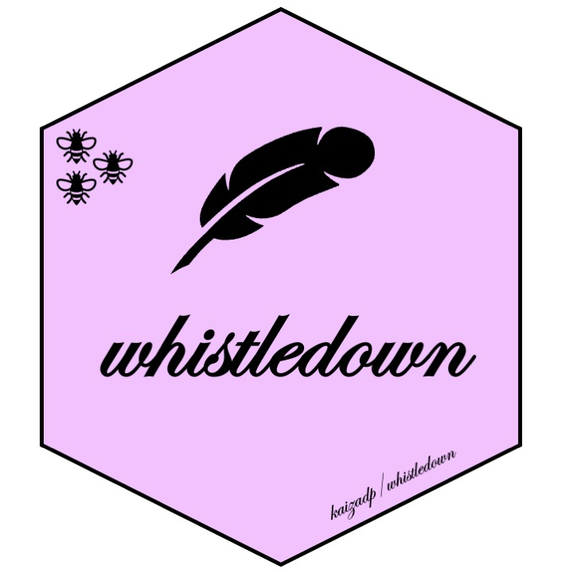
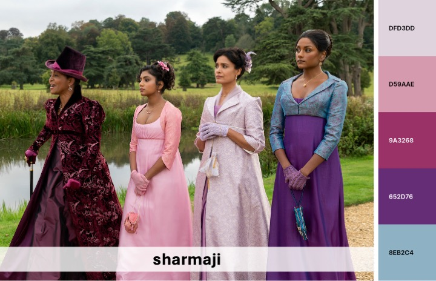
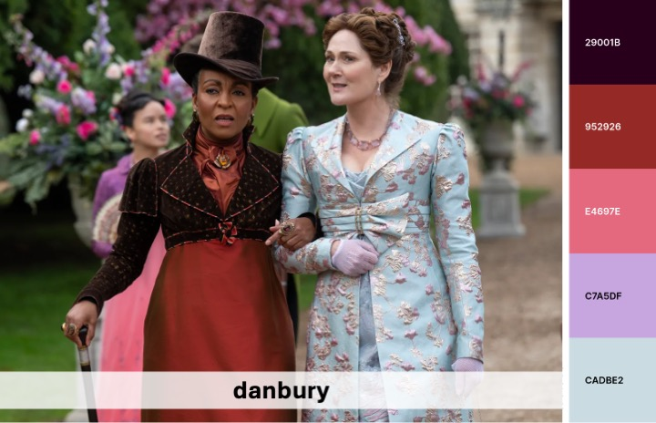
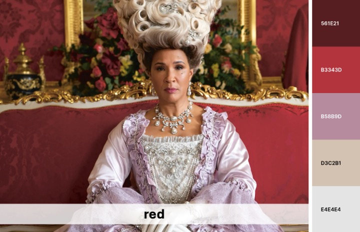
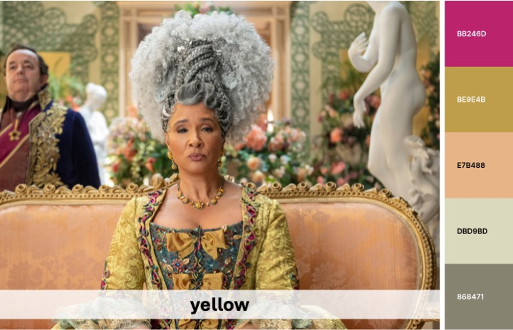
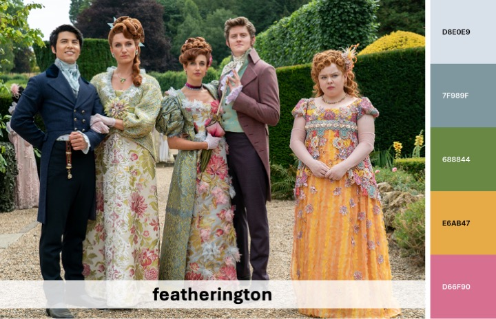

```{r echo=FALSE}
knitr::opts_chunk$set(
  collapse = TRUE,
  echo=FALSE,
  message = FALSE,
  warning = FALSE,
  error = FALSE,
  comment = "#>",
  fig.height = 1
)
```




# whistledown  

This package contains color palettes for RStudio, inspired by the show Bridgerton.
Palettes are colorblind-friendly and were created using [Coolors](https://coolors.co).  


Source images and color hex values can be found in the  [`images.md`](https://github.com/kaizadp/whistledown/blob/master/images.md) file in the root directory. 

---

### install package

```{r echo = TRUE}
# install.packages("devtools") 
devtools::install_github("kaizadp/whistledown")
```

----

<details>
  <summary>Palettes</summary>
  
```{r palettes, eval = T}
library(whistledown)

# whistledown_palette(name="sharmaji",5)
# whistledown_palette(name="red",5)
# whistledown_palette(name="featherington",5)
# whistledown_palette(name="danbury",5)

```












----

</details>

<details>
  <summary>Examples</summary>
```{r usage1, fig.height=4, fig.width=5, echo=TRUE}
library(ggplot2)

ggplot(data=iris, aes(x=Sepal.Width, fill = Species))+
  geom_histogram(binwidth=0.2, color="black") + 
  xlab("Sepal Width") +  ylab("Frequency") + 
  ggtitle("Histogram of Sepal Width") + theme_bw()+
  
  scale_fill_manual(values = whistledown_palette("featherington",3))
```

```{r usage2, fig.height=4, fig.width=5, echo=TRUE}
ggplot(data=iris, aes(x=Sepal.Width, fill=Species)) + 
  geom_density(stat="density", alpha=(0.6)) +
  xlab("Sepal Width") +  ylab("Density") + 
  ggtitle("Histogram & Density Curve of Sepal Width") + theme_bw()+
  
  scale_fill_manual(values = whistledown_palette("red",3))

```

```{r usage3, fig.height=4, fig.width=5, echo=TRUE}
library(palmerpenguins)

ggplot(penguins, aes(x = bill_length_mm, y = bill_depth_mm, color = species))+
  geom_point()+ 
  labs(x = "Bill length (mm)", y = "Bill depth (mm)",
       title = "Scatterplot of penguin bill dimensions",
       subtitle = "data = Palmer Penguins")+
  theme_bw()+
  
  scale_color_manual(values = whistledown_palette("danbury", 3)) 
```

```{r usage4, fig.height=4, fig.width=5, echo=TRUE}
ggplot(penguins, aes(y = body_mass_g, x = species, fill = species))+
  geom_violin(alpha = 0.5)+ 
  geom_dotplot(binaxis = "y", color = "black", fill="black", dotsize=0.3, stackdir = "center", binpositions="all")+
  labs(y = "Body mass (g)", x = "",
       title = "Violin plot of penguin body mass",
       subtitle = "data = Palmer Penguins")+
  theme_bw()+
  
  scale_fill_manual(values = whistledown_palette("sharmaji", 3)) 
```

```{r usage5, fig.height=4, fig.width=5, echo=TRUE}
ggplot(penguins, aes(x = bill_length_mm, y = bill_depth_mm, color = bill_length_mm))+
  geom_point()+ 
  labs(x = "Bill length (mm)", y = "Bill depth (mm)",
       title = "Scatterplot of penguin bill dimensions",
       subtitle = "data = Palmer Penguins")+
  theme_bw()+
  
  scale_color_gradientn(colors = rev(whistledown_palette("featherington",5))) 
```
</details>


<details>
  <summary>Acknowledgments and Contributions</summary>
  
Code structure was modelled after the [`PNWColors`](https://github.com/jakelawlor/PNWColors) and [`wesanderson`](https://github.com/karthik/wesanderson) packages.  
Contribute soil palettes in the [issues](https://github.com/kaizadp/soilpalettes/issues/6).

</summary>
